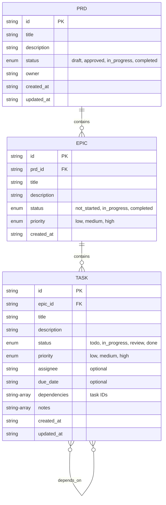

# Task Manager MCP Server

A Model Context Protocol server for managing Product Requirements Documents (PRDs), Epics, and Tasks in a hierarchical structure. This enables LLMs to create, track, and manage software development projects.

## Data Model

The system uses a hierarchical structure with three main entities:



**Key Relationships:**

- **PRD → Epic**: One-to-many (a PRD can contain multiple Epics)
- **Epic → Task**: One-to-many (an Epic can contain multiple Tasks)
- **Task → Task**: Many-to-many self-referencing (Tasks can depend on other Tasks)
- **Cascading Deletes**: Removing a PRD deletes all its Epics and Tasks

## Core Concepts

### PRDs (Product Requirements Documents)

Top-level documents that define product features and requirements.

- Unique ID
- Title and description
- Status (draft, approved, in_progress, completed)
- Owner
- Creation and update timestamps

Example:

```json
{
  "id": "prd_001",
  "title": "User Authentication System",
  "description": "Implement secure user authentication...",
  "status": "approved",
  "owner": "john_doe",
  "created_at": "2025-01-15T10:00:00Z",
  "updated_at": "2025-01-15T10:00:00Z"
}
```

### Epics

Major features or components that implement parts of a PRD.

- Unique ID
- Linked to a PRD
- Title and description
- Status and priority
- Creation timestamp

Example:

```json
{
  "id": "epic_001",
  "prd_id": "prd_001",
  "title": "OAuth2 Integration",
  "description": "Implement OAuth2 for third-party login",
  "status": "in_progress",
  "priority": "high",
  "created_at": "2025-01-16T10:00:00Z"
}
```

### Tasks

Specific work items that implement parts of an epic.

- Unique ID
- Linked to an epic
- Title and description
- Status, priority, assignee
- Optional due date and dependencies
- Notes for progress tracking

Example:

```json
{
  "id": "task_001",
  "epic_id": "epic_001",
  "title": "Setup OAuth2 provider configuration",
  "description": "Configure Google and GitHub OAuth providers",
  "status": "in_progress",
  "priority": "high",
  "assignee": "jane_smith",
  "due_date": "2025-01-20T00:00:00Z",
  "dependencies": [],
  "notes": ["Completed Google setup", "GitHub pending approval"],
  "created_at": "2025-01-17T10:00:00Z",
  "updated_at": "2025-01-18T14:30:00Z"
}
```

## API Tools

### PRD Management

- **create_prd**

  - Create a new Product Requirements Document
  - Input: `title`, `description`, `owner`
  - Returns: Created PRD with generated ID

- **update_prd**

  - Update an existing PRD
  - Input: `id`, optional `title`, `description`, `status`, `owner`
  - Returns: Updated PRD

- **delete_prd**
  - Delete a PRD and all associated epics and tasks
  - Input: `id`
  - Cascading deletion

### Epic Management

- **create_epics**

  - Create multiple epics linked to a PRD
  - Input: `epics` array with `prd_id`, `title`, `description`, `priority`
  - Returns: Created epics with generated IDs

- **update_epic**

  - Update an existing epic
  - Input: `id`, optional fields to update
  - Returns: Updated epic

- **delete_epics**
  - Delete epics and their associated tasks
  - Input: `ids` array
  - Cascading deletion

### Task Management

- **create_tasks**

  - Create multiple tasks linked to epics
  - Input: `tasks` array with task details
  - Returns: Created tasks with generated IDs

- **update_task**

  - Update task details, status, or assignee
  - Input: `id`, optional fields to update
  - Returns: Updated task

- **add_task_notes**

  - Add progress notes to tasks
  - Input: `task_id`, `notes` array
  - Returns: Updated task

- **delete_tasks**
  - Delete multiple tasks
  - Input: `ids` array

### Query Tools

- **read_project**

  - Read entire project hierarchy
  - Input: `prd_id` (optional)
  - Returns: PRDs with nested epics and tasks

- **search_items**

  - Search across PRDs, epics, and tasks
  - Input: `query`, `item_type` (optional filter)
  - Returns: Matching items

- **get_tasks_by_status**

  - Get tasks filtered by status
  - Input: `status`, optional `epic_id`, `assignee`
  - Returns: Filtered tasks

- **get_tasks_by_assignee**
  - Get all tasks for a specific assignee
  - Input: `assignee`
  - Returns: Assigned tasks

## Usage with Claude Desktop

Add this to your claude_desktop_config.json:

### NPX

```json
{
  "mcpServers": {
    "task-manager": {
      "command": "npx",
      "args": ["-y", "@modelcontextprotocol/server-task-manager"]
    }
  }
}
```

### Docker

```json
{
  "mcpServers": {
    "task-manager": {
      "command": "docker",
      "args": ["run", "-i", "-v", "task-manager-data:/app/data", "--rm", "mcp/task-manager"]
    }
  }
}
```

### Custom Storage Path

```json
{
  "mcpServers": {
    "task-manager": {
      "command": "npx",
      "args": ["-y", "@modelcontextprotocol/server-task-manager"],
      "env": {
        "TASK_FILE_PATH": "/path/to/custom/tasks.json"
      }
    }
  }
}
```

## Resource Subscriptions (v0.2.0)

The server now supports real-time resource subscriptions for live updates:

### Available Resources

1. **Project State**: `project://{prd_id}`

   - Live project state with PRD, epics, and tasks
   - Includes real-time statistics and metadata

2. **Personal Dashboard**: `dashboard://assignee/{name}`

   - Real-time task dashboard for an assignee
   - Query parameters:
     - `?showCompleted=false` - Hide completed tasks
     - `?days=7` - Show only tasks updated in last 7 days
     - `?priority=high` - Filter by priority (low/medium/high)

3. **Burndown Metrics**: `metrics://burndown/{prd_id}`

   - Project burndown charts and velocity metrics
   - Team load distribution

4. **Event Stream**: `events://project/{prd_id}`
   - Real-time event log for project changes

### Example Usage

```typescript
// Subscribe to dashboard with filters
await client.subscribe({
  uri: "dashboard://assignee/john_doe?showCompleted=false&days=7",
});

// Subscribe to project updates
await client.subscribe({
  uri: "project://prd_123",
});
```

## System Prompts for Different LLMs

### PRD Creation LLM

```
You are a product requirements specialist. When asked to create a PRD:
1. Use create_prd to establish the main document
2. Include clear success criteria and user stories
3. Reference existing PRDs using search_items to maintain consistency
4. Set appropriate status (usually "draft" initially)
```

### Task Breakdown LLM

```
You are a project planning specialist. When given a PRD:
1. Use read_project to understand the full PRD
2. Create epics using create_epics for major feature areas
3. Break down each epic into specific tasks using create_tasks
4. Ensure tasks are atomic and have clear acceptance criteria
5. Set appropriate priorities and dependencies
```

### Task Execution LLM

```
You are a development assistant. For task management:
1. Use get_tasks_by_assignee to see assigned work
2. Update task status as work progresses using update_task
3. Add implementation notes using add_task_notes
4. Check dependencies before starting tasks
5. Search for related tasks to understand context
```

## Data Persistence

The server stores all data in a single JSON lines file where each line represents a PRD, Epic, or Task. This allows for:

- Simple backup and restore
- Easy debugging and manual inspection
- Atomic writes for data integrity
- Efficient append operations

## Building

```sh
cd /projects/project-manager-mcp
npm install
npm run build
```

Docker:

```sh
docker build -t mcp/task-manager .
```

## License

This MCP server is licensed under the MIT License.
