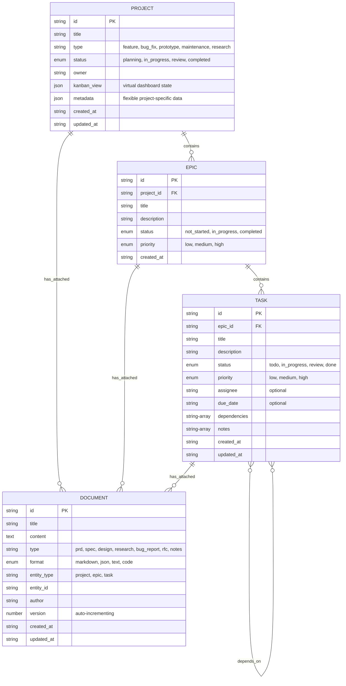

# Project-Centric Architecture with Universal Document Primitives

**Status: PLANNED**

## Overview

This document outlines a fundamental architectural shift from the current rigid PRD-centric model to a flexible Project-centric approach with Documents as universal knowledge primitives. This change addresses real-world project management needs by supporting diverse project types from rapid prototyping to formal enterprise development.

## Current vs. Proposed Architecture

### Current: Rigid PRD-Centric Model

```typescript
// Forced hierarchy - every project must start with PRD
PRD -> Epic -> Task

// Rigid workflow
1. Create PRD (required bureaucratic step)
2. Break into Epics
3. Create Tasks
4. All documentation must fit into description fields
```

**Problems:**

- Forces formal PRD creation for simple projects (bug fixes, prototypes)
- Limited documentation capabilities
- Assumes greenfield development process
- Poor fit for maintenance, research, or rapid iteration projects

### Proposed: Flexible Project-Centric Model

```typescript
// Flexible hierarchy - start with what you need
Project (state container) -> Epic -> Task
Documents (universal primitive) -> Attach to any level

// Adaptive workflow
1. Create Project (lightweight state container)
2. Add Documents as needed (specs, designs, research, etc.)
3. Create Epics/Tasks based on project type
4. Documents provide rich context at any level
```

**Benefits:**

- **Project Types**: Bug fix, prototype, feature, maintenance, research
- **Flexible Documentation**: Attach specs, designs, research anywhere
- **Natural Workflow**: Structure emerges based on needs
- **Agent Adaptability**: AI agents adapt to project context

## Data Model Transformation

### New Entity Relationships



### Key Changes

1. **PRD → Project**: PRD becomes a Document type, Project becomes the state container
2. **Universal Documents**: Can attach to Project, Epic, or Task
3. **Kanban State**: Project includes virtual dashboard representation
4. **Flexible Typing**: Project types and Document types adapt to use case

## Implementation Guide

### Step 1: Update Core Types

Update `types.ts` with new interfaces:

```typescript
// New Project interface (replaces PRD as hierarchy root)
export interface Project {
  id: string;
  title: string;
  type: "feature" | "bug_fix" | "prototype" | "maintenance" | "research" | "custom";
  status: "planning" | "in_progress" | "review" | "completed" | "archived";
  owner: string;
  kanban_view: {
    todo: string[]; // Array of epic/task IDs
    in_progress: string[];
    review: string[];
    done: string[];
  };
  metadata: Record<string, any>; // Flexible project-specific data
  created_at: string;
  updated_at: string;
}

// New Document interface (universal knowledge primitive)
export interface Document {
  id: string;
  title: string;
  content: string;
  type: string; // Flexible: "prd", "spec", "design", "research", "bug_report", "rfc", "notes", etc.
  format: "markdown" | "json" | "text" | "code";
  entity_type: "project" | "epic" | "task";
  entity_id: string;
  author: string;
  version: number; // Auto-incrementing for document history
  created_at: string;
  updated_at: string;
}

// Updated Epic interface (now links to Project)
export interface Epic {
  id: string;
  project_id: string; // Changed from prd_id
  title: string;
  description: string;
  status: "not_started" | "in_progress" | "completed";
  priority: "low" | "medium" | "high";
  created_at: string;
}

// Task interface remains mostly the same
export interface Task {
  id: string;
  epic_id: string;
  title: string;
  description: string;
  status: "todo" | "in_progress" | "review" | "done";
  priority: "low" | "medium" | "high";
  assignee?: string;
  due_date?: string;
  dependencies: string[];
  notes: string[];
  created_at: string;
  updated_at: string;
}

// Updated data types
export type DataItem =
  | ({ type: "project" } & Project)
  | ({ type: "document" } & Document)
  | ({ type: "epic" } & Epic)
  | ({ type: "task" } & Task);

export interface ProjectData {
  projects: Project[];
  documents: Document[];
  epics: Epic[];
  tasks: Task[];
}

// Enhanced project view with attached documents
export interface ProjectWithDetails extends Project {
  documents: Document[];
  epics: Array<
    Epic & {
      tasks: Task[];
      documents: Document[];
    }
  >;
}
```

### Step 2: Create Document Management API

Add new tool functions for document management:

```typescript
// Document Management Tools
export interface CreateDocumentParams {
  title: string;
  content: string;
  type: string;
  format: "markdown" | "json" | "text" | "code";
  entity_type: "project" | "epic" | "task";
  entity_id: string;
  author: string;
}

export interface UpdateDocumentParams {
  id: string;
  title?: string;
  content?: string;
  type?: string;
  format?: "markdown" | "json" | "text" | "code";
}

export interface AttachDocumentParams {
  document_id: string;
  entity_type: "project" | "epic" | "task";
  entity_id: string;
}

// Project Management Tools (replaces PRD tools)
export interface CreateProjectParams {
  title: string;
  description?: string; // Optional, can be added as document
  type: "feature" | "bug_fix" | "prototype" | "maintenance" | "research" | "custom";
  owner: string;
  metadata?: Record<string, any>;
}

export interface UpdateProjectParams {
  id: string;
  title?: string;
  type?: "feature" | "bug_fix" | "prototype" | "maintenance" | "research" | "custom";
  status?: "planning" | "in_progress" | "review" | "completed" | "archived";
  owner?: string;
  kanban_view?: {
    todo: string[];
    in_progress: string[];
    review: string[];
    done: string[];
  };
  metadata?: Record<string, any>;
}

// Onboarding Tools
export interface OnboardParams {
  entity_type: "project" | "epic" | "task";
  entity_id: string;
  include_context?: boolean; // Include parent/sibling context
  include_history?: boolean; // Include change history
}

export interface OnboardResponse {
  entity: Project | Epic | Task;
  documents: Document[];
  context?: {
    parent?: Project | Epic;
    siblings?: Array<Epic | Task>;
    children?: Array<Epic | Task>;
  };
  history?: Array<{
    timestamp: string;
    action: string;
    changes: Record<string, any>;
  }>;
}
```

### Step 3: Implement New API Methods

Add these methods to your TaskManager class:

```typescript
class TaskManager {
  // Project Management (replaces PRD methods)
  async createProject(params: CreateProjectParams): Promise<Project> {
    const data = await this.loadData();
    const project: Project = {
      id: this.generateId("proj"),
      ...params,
      status: "planning",
      kanban_view: { todo: [], in_progress: [], review: [], done: [] },
      metadata: params.metadata || {},
      created_at: new Date().toISOString(),
      updated_at: new Date().toISOString(),
    };

    data.projects.push(project);
    await this.saveData(data);
    await this.notifyChange("created", "project", project);
    return project;
  }

  async updateProject(params: UpdateProjectParams): Promise<Project> {
    const data = await this.loadData();
    const projectIndex = data.projects.findIndex((p) => p.id === params.id);

    if (projectIndex === -1) {
      throw new Error(`Project ${params.id} not found`);
    }

    const oldProject = { ...data.projects[projectIndex] };
    const updatedProject = {
      ...data.projects[projectIndex],
      ...params,
      updated_at: new Date().toISOString(),
    };

    data.projects[projectIndex] = updatedProject;
    await this.saveData(data);
    await this.notifyChange("updated", "project", updatedProject, oldProject);
    return updatedProject;
  }

  // Document Management
  async createDocument(params: CreateDocumentParams): Promise<Document> {
    const data = await this.loadData();

    // Validate entity exists
    await this.validateEntityExists(params.entity_type, params.entity_id, data);

    const document: Document = {
      id: this.generateId("doc"),
      ...params,
      version: 1,
      created_at: new Date().toISOString(),
      updated_at: new Date().toISOString(),
    };

    data.documents.push(document);
    await this.saveData(data);
    await this.notifyChange("created", "document", document);
    return document;
  }

  async updateDocument(params: UpdateDocumentParams): Promise<Document> {
    const data = await this.loadData();
    const docIndex = data.documents.findIndex((d) => d.id === params.id);

    if (docIndex === -1) {
      throw new Error(`Document ${params.id} not found`);
    }

    const oldDoc = { ...data.documents[docIndex] };
    const updatedDoc = {
      ...data.documents[docIndex],
      ...params,
      version: oldDoc.version + 1, // Increment version
      updated_at: new Date().toISOString(),
    };

    data.documents[docIndex] = updatedDoc;
    await this.saveData(data);
    await this.notifyChange("updated", "document", updatedDoc, oldDoc);
    return updatedDoc;
  }

  async getDocumentsByEntity(entityType: string, entityId: string): Promise<Document[]> {
    const data = await this.loadData();
    return data.documents.filter((d) => d.entity_type === entityType && d.entity_id === entityId);
  }

  // Onboarding System
  async onboard(params: OnboardParams): Promise<OnboardResponse> {
    const data = await this.loadData();

    // Get the main entity
    let entity: Project | Epic | Task;
    switch (params.entity_type) {
      case "project":
        entity = data.projects.find((p) => p.id === params.entity_id);
        break;
      case "epic":
        entity = data.epics.find((e) => e.id === params.entity_id);
        break;
      case "task":
        entity = data.tasks.find((t) => t.id === params.entity_id);
        break;
      default:
        throw new Error(`Invalid entity type: ${params.entity_type}`);
    }

    if (!entity) {
      throw new Error(`${params.entity_type} ${params.entity_id} not found`);
    }

    // Get attached documents
    const documents = await this.getDocumentsByEntity(params.entity_type, params.entity_id);

    // Build response
    const response: OnboardResponse = { entity, documents };

    // Add context if requested
    if (params.include_context) {
      response.context = await this.buildEntityContext(params.entity_type, params.entity_id, data);
    }

    // Add history if requested
    if (params.include_history) {
      response.history = await this.getEntityHistory(params.entity_type, params.entity_id);
    }

    return response;
  }

  // Enhanced project reading with documents
  async readProjectWithDocuments(projectId: string): Promise<ProjectWithDetails> {
    const data = await this.loadData();
    const project = data.projects.find((p) => p.id === projectId);

    if (!project) {
      throw new Error(`Project ${projectId} not found`);
    }

    // Get project documents
    const projectDocs = await this.getDocumentsByEntity("project", projectId);

    // Get epics with their tasks and documents
    const epics = data.epics
      .filter((e) => e.project_id === projectId)
      .map((epic) => {
        const tasks = data.tasks.filter((t) => t.epic_id === epic.id);
        const epicDocs = data.documents.filter(
          (d) => d.entity_type === "epic" && d.entity_id === epic.id
        );
        return { ...epic, tasks, documents: epicDocs };
      });

    return {
      ...project,
      documents: projectDocs,
      epics,
    };
  }

  // Helper methods
  private async validateEntityExists(
    entityType: string,
    entityId: string,
    data: ProjectData
  ): Promise<void> {
    let exists = false;
    switch (entityType) {
      case "project":
        exists = data.projects.some((p) => p.id === entityId);
        break;
      case "epic":
        exists = data.epics.some((e) => e.id === entityId);
        break;
      case "task":
        exists = data.tasks.some((t) => t.id === entityId);
        break;
    }

    if (!exists) {
      throw new Error(`${entityType} ${entityId} not found`);
    }
  }

  private async buildEntityContext(
    entityType: string,
    entityId: string,
    data: ProjectData
  ): Promise<any> {
    const context: any = {};

    if (entityType === "epic") {
      // Add parent project
      const epic = data.epics.find((e) => e.id === entityId);
      if (epic) {
        context.parent = data.projects.find((p) => p.id === epic.project_id);
        context.siblings = data.epics.filter(
          (e) => e.project_id === epic.project_id && e.id !== entityId
        );
        context.children = data.tasks.filter((t) => t.epic_id === entityId);
      }
    } else if (entityType === "task") {
      // Add parent epic and project
      const task = data.tasks.find((t) => t.id === entityId);
      if (task) {
        const epic = data.epics.find((e) => e.id === task.epic_id);
        if (epic) {
          context.parent = epic;
          context.siblings = data.tasks.filter(
            (t) => t.epic_id === task.epic_id && t.id !== entityId
          );
          // Add grandparent project
          const project = data.projects.find((p) => p.id === epic.project_id);
          if (project) {
            context.grandparent = project;
          }
        }
      }
    } else if (entityType === "project") {
      // Add children epics
      context.children = data.epics.filter((e) => e.project_id === entityId);
    }

    return context;
  }

  private async getEntityHistory(entityType: string, entityId: string): Promise<any[]> {
    // In production, you'd have a separate audit log
    // For now, return mock history
    return [
      {
        timestamp: new Date().toISOString(),
        action: "created",
        changes: { status: "new" },
      },
    ];
  }
}
```

### Step 4: Update API Tool Definitions

Update the MCP server tools in `index.ts`:

```typescript
// Project Management Tools
server.setRequestHandler(CallToolRequestSchema, async (request) => {
  const { name, arguments: args } = request.params;

  switch (name) {
    case "create_project":
      return {
        content: [
          {
            type: "text",
            text: JSON.stringify(await taskManager.createProject(args), null, 2),
          },
        ],
      };

    case "update_project":
      return {
        content: [
          {
            type: "text",
            text: JSON.stringify(await taskManager.updateProject(args), null, 2),
          },
        ],
      };

    case "create_document":
      return {
        content: [
          {
            type: "text",
            text: JSON.stringify(await taskManager.createDocument(args), null, 2),
          },
        ],
      };

    case "update_document":
      return {
        content: [
          {
            type: "text",
            text: JSON.stringify(await taskManager.updateDocument(args), null, 2),
          },
        ],
      };

    case "get_documents":
      const docs = await taskManager.getDocumentsByEntity(args.entity_type, args.entity_id);
      return {
        content: [
          {
            type: "text",
            text: JSON.stringify(docs, null, 2),
          },
        ],
      };

    case "onboard":
      return {
        content: [
          {
            type: "text",
            text: JSON.stringify(await taskManager.onboard(args), null, 2),
          },
        ],
      };

    case "read_project":
      // Updated to use new method
      const project = args.project_id
        ? await taskManager.readProjectWithDocuments(args.project_id)
        : await taskManager.listAllProjects();
      return {
        content: [
          {
            type: "text",
            text: JSON.stringify(project, null, 2),
          },
        ],
      };

    // ... existing tool handlers (create_epics, create_tasks, etc.)
    // Update these to use project_id instead of prd_id
  }
});
```

### Step 5: Define Tool Schema

Update the tool definitions:

```typescript
const tools: Tool[] = [
  // Project Management
  {
    name: "create_project",
    description: "Create a new project (replaces create_prd)",
    inputSchema: {
      type: "object",
      properties: {
        title: { type: "string", description: "Project title" },
        description: { type: "string", description: "Optional project description" },
        type: {
          type: "string",
          enum: ["feature", "bug_fix", "prototype", "maintenance", "research", "custom"],
          description: "Type of project",
        },
        owner: { type: "string", description: "Project owner" },
        metadata: {
          type: "object",
          description: "Optional project-specific metadata",
          additionalProperties: true,
        },
      },
      required: ["title", "type", "owner"],
    },
  },

  {
    name: "update_project",
    description: "Update an existing project",
    inputSchema: {
      type: "object",
      properties: {
        id: { type: "string", description: "Project ID" },
        title: { type: "string", description: "New title" },
        type: {
          type: "string",
          enum: ["feature", "bug_fix", "prototype", "maintenance", "research", "custom"],
        },
        status: {
          type: "string",
          enum: ["planning", "in_progress", "review", "completed", "archived"],
        },
        owner: { type: "string", description: "New owner" },
        kanban_view: {
          type: "object",
          properties: {
            todo: { type: "array", items: { type: "string" } },
            in_progress: { type: "array", items: { type: "string" } },
            review: { type: "array", items: { type: "string" } },
            done: { type: "array", items: { type: "string" } },
          },
        },
        metadata: { type: "object", additionalProperties: true },
      },
      required: ["id"],
    },
  },

  // Document Management
  {
    name: "create_document",
    description: "Create a document and attach it to a project, epic, or task",
    inputSchema: {
      type: "object",
      properties: {
        title: { type: "string", description: "Document title" },
        content: { type: "string", description: "Document content" },
        type: {
          type: "string",
          description: "Document type (e.g., 'prd', 'spec', 'design', 'research', 'bug_report')",
        },
        format: {
          type: "string",
          enum: ["markdown", "json", "text", "code"],
          description: "Document format",
        },
        entity_type: {
          type: "string",
          enum: ["project", "epic", "task"],
          description: "Type of entity to attach to",
        },
        entity_id: { type: "string", description: "ID of entity to attach to" },
        author: { type: "string", description: "Document author" },
      },
      required: ["title", "content", "type", "format", "entity_type", "entity_id", "author"],
    },
  },

  {
    name: "update_document",
    description: "Update an existing document",
    inputSchema: {
      type: "object",
      properties: {
        id: { type: "string", description: "Document ID" },
        title: { type: "string", description: "New title" },
        content: { type: "string", description: "New content" },
        type: { type: "string", description: "New document type" },
        format: {
          type: "string",
          enum: ["markdown", "json", "text", "code"],
        },
      },
      required: ["id"],
    },
  },

  {
    name: "get_documents",
    description: "Get all documents attached to a specific entity",
    inputSchema: {
      type: "object",
      properties: {
        entity_type: {
          type: "string",
          enum: ["project", "epic", "task"],
          description: "Type of entity",
        },
        entity_id: { type: "string", description: "Entity ID" },
      },
      required: ["entity_type", "entity_id"],
    },
  },

  // Onboarding System
  {
    name: "onboard",
    description:
      "Get comprehensive context for a project, epic, or task including attached documents and relationships",
    inputSchema: {
      type: "object",
      properties: {
        entity_type: {
          type: "string",
          enum: ["project", "epic", "task"],
          description: "Type of entity to onboard to",
        },
        entity_id: { type: "string", description: "Entity ID" },
        include_context: {
          type: "boolean",
          description: "Include parent/sibling/children context",
          default: true,
        },
        include_history: {
          type: "boolean",
          description: "Include change history",
          default: false,
        },
      },
      required: ["entity_type", "entity_id"],
    },
  },

  // Updated existing tools
  {
    name: "create_epics",
    description: "Create multiple epics linked to a project",
    inputSchema: {
      type: "object",
      properties: {
        epics: {
          type: "array",
          items: {
            type: "object",
            properties: {
              project_id: { type: "string", description: "ID of the parent project" }, // Changed from prd_id
              title: { type: "string", description: "Epic title" },
              description: { type: "string", description: "Epic description" },
              priority: { type: "string", enum: ["low", "medium", "high"] },
            },
            required: ["project_id", "title", "description", "priority"],
          },
        },
      },
      required: ["epics"],
    },
  },

  // ... rest of existing tools with project_id updates where needed
];
```

## Migration Strategy

### Phase 1: Backward Compatibility (Week 1)

1. **Add new entities** without breaking existing API
2. **Implement PRD-to-Project bridge**:

   ```typescript
   // Temporary bridge for existing PRD tools
   async createPRD(title: string, description: string, owner: string): Promise<PRD> {
     // Create project
     const project = await this.createProject({
       title,
       type: "feature",
       owner,
     });

     // Create PRD document attached to project
     const prdDoc = await this.createDocument({
       title: "Product Requirements Document",
       content: description,
       type: "prd",
       format: "markdown",
       entity_type: "project",
       entity_id: project.id,
       author: owner,
     });

     // Return PRD-compatible object
     return {
       id: project.id,
       title: project.title,
       description,
       status: project.status as any,
       owner: project.owner,
       created_at: project.created_at,
       updated_at: project.updated_at,
     };
   }
   ```

3. **Deploy with both APIs available**

### Phase 2: Client Migration (Week 2)

1. **Update documentation** with migration examples
2. **Provide migration tools**:

   ```typescript
   // Migration utility
   async migratePRDToProject(prdId: string): Promise<Project> {
     const prd = await this.getPRD(prdId);

     const project = await this.createProject({
       title: prd.title,
       type: "feature",
       owner: prd.owner,
     });

     // Migrate description to document
     await this.createDocument({
       title: "Product Requirements Document",
       content: prd.description,
       type: "prd",
       format: "markdown",
       entity_type: "project",
       entity_id: project.id,
       author: prd.owner,
     });

     // Update epics to point to new project
     const epics = await this.getEpicsByPRD(prdId);
     for (const epic of epics) {
       await this.updateEpic(epic.id, { project_id: project.id });
     }

     return project;
   }
   ```

### Phase 3: Deprecation (Week 3)

1. **Mark PRD tools as deprecated**
2. **Add warnings to old API calls**
3. **Provide clear migration path in responses**

### Phase 4: Cleanup (Week 4)

1. **Remove deprecated PRD tools**
2. **Update all documentation**
3. **Clean up bridge code**

## Use Case Examples

### 1. Bug Fix Project

```typescript
// Create lightweight bug fix project
const project = await createProject({
  title: "Fix login timeout issue",
  type: "bug_fix",
  owner: "jane_smith",
});

// Attach bug report
await createDocument({
  title: "Bug Report #1234",
  content: "Users experiencing timeouts after 5 minutes...",
  type: "bug_report",
  format: "markdown",
  entity_type: "project",
  entity_id: project.id,
  author: "user_reporter",
});

// Create single epic
const epic = await createEpics({
  epics: [
    {
      project_id: project.id,
      title: "Fix timeout logic",
      description: "Update session management",
      priority: "high",
    },
  ],
});

// Create tasks with attached code snippets
const tasks = await createTasks({
  tasks: [
    {
      epic_id: epic[0].id,
      title: "Update session timeout constant",
      description: "Change from 5min to 30min",
      priority: "high",
      assignee: "jane_smith",
    },
  ],
});

// Attach implementation snippet
await createDocument({
  title: "Code fix",
  content: "const SESSION_TIMEOUT = 30 * 60 * 1000; // 30 minutes",
  type: "code_snippet",
  format: "code",
  entity_type: "task",
  entity_id: tasks[0].id,
  author: "jane_smith",
});
```

### 2. Research Project

```typescript
// Create research project
const project = await createProject({
  title: "Evaluate new authentication methods",
  type: "research",
  owner: "research_team",
});

// Attach research documents
await createDocument({
  title: "OAuth vs SAML Analysis",
  content: "Comparison of authentication protocols...",
  type: "research",
  format: "markdown",
  entity_type: "project",
  entity_id: project.id,
  author: "security_researcher",
});

await createDocument({
  title: "Competitive Analysis",
  content: "How competitors handle auth...",
  type: "competitive_analysis",
  format: "markdown",
  entity_type: "project",
  entity_id: project.id,
  author: "product_researcher",
});

// Create research epics
const epics = await createEpics({
  epics: [
    {
      project_id: project.id,
      title: "Technical Evaluation",
      description: "Assess technical feasibility",
      priority: "high",
    },
    {
      project_id: project.id,
      title: "User Experience Research",
      description: "Test user acceptance",
      priority: "medium",
    },
  ],
});
```

### 3. Feature Project with Formal PRD

```typescript
// Create feature project
const project = await createProject({
  title: "Multi-factor Authentication",
  type: "feature",
  owner: "product_team",
});

// Attach formal PRD
await createDocument({
  title: "Product Requirements Document",
  content: `
# Multi-factor Authentication

## Overview
Implement secure 2FA for all user accounts...

## User Stories
- As a user, I want to enable 2FA
- As an admin, I want to enforce 2FA

## Success Criteria
- 95% user adoption within 3 months
- Zero security incidents related to authentication
  `,
  type: "prd",
  format: "markdown",
  entity_type: "project",
  entity_id: project.id,
  author: "product_manager",
});

// Attach design docs
await createDocument({
  title: "UX Flow Design",
  content: "User flow diagrams and wireframes...",
  type: "design",
  format: "markdown",
  entity_type: "project",
  entity_id: project.id,
  author: "ux_designer",
});

// Create detailed epics
const epics = await createEpics({
  epics: [
    {
      project_id: project.id,
      title: "SMS-based 2FA",
      description: "Implement SMS verification",
      priority: "high",
    },
    {
      project_id: project.id,
      title: "App-based 2FA",
      description: "Support TOTP apps like Google Authenticator",
      priority: "medium",
    },
  ],
});
```

## Agent Workflow Examples

### 1. Agent Joining Existing Project

```typescript
// Agent calls onboard for comprehensive context
const context = await onboard({
  entity_type: "project",
  entity_id: "proj_auth_mfa",
  include_context: true,
  include_history: true,
});

// Agent now has:
// - Project details and current status
// - All attached documents (PRD, designs, research)
// - All epics and their status
// - All tasks and assignments
// - Change history

// Agent can immediately contribute based on project type
if (context.entity.type === "bug_fix") {
  // Focus on debugging and quick fixes
} else if (context.entity.type === "feature") {
  // Follow formal development process
} else if (context.entity.type === "research") {
  // Focus on analysis and documentation
}
```

### 2. Agent Starting New Task

```typescript
// Agent gets context for specific task
const taskContext = await onboard({
  entity_type: "task",
  entity_id: "task_implement_sms",
  include_context: true,
});

// Agent has:
// - Task details and requirements
// - Parent epic context
// - Grandparent project context
// - All relevant documents at every level
// - Sibling tasks for coordination

// Agent can access implementation specs
const taskDocs = await getDocuments({
  entity_type: "task",
  entity_id: "task_implement_sms",
});

// Agent can access broader design context
const epicDocs = await getDocuments({
  entity_type: "epic",
  entity_id: taskContext.context.parent.id,
});
```

### 3. Agent Creating Documentation

```typescript
// Agent analyzes project needs and creates appropriate docs
if (project.type === "feature" && !hasDocument("technical_spec")) {
  await createDocument({
    title: "Technical Specification",
    content: generateTechnicalSpec(project, epics, tasks),
    type: "technical_spec",
    format: "markdown",
    entity_type: "project",
    entity_id: project.id,
    author: "ai_agent",
  });
}

// Agent creates task-specific implementation notes
await createDocument({
  title: "Implementation Notes",
  content: "Key considerations and code snippets...",
  type: "implementation_notes",
  format: "markdown",
  entity_type: "task",
  entity_id: task.id,
  author: "ai_agent",
});
```

## Benefits Analysis

### 1. Flexibility Benefits

| Project Type | Traditional PRD Model                  | New Project Model                         |
| ------------ | -------------------------------------- | ----------------------------------------- |
| Bug Fix      | ❌ Forces unnecessary PRD creation     | ✅ Lightweight project + bug report doc   |
| Prototype    | ❌ Premature formal requirements       | ✅ Project + design docs, rapid iteration |
| Research     | ❌ Poor fit for open-ended exploration | ✅ Project + multiple research documents  |
| Feature      | ✅ Works well                          | ✅ Works even better with flexible docs   |
| Maintenance  | ❌ Overkill for routine updates        | ✅ Simple project + maintenance docs      |

### 2. Agent Productivity Benefits

- **Faster Onboarding**: Single `onboard()` call provides complete context
- **Contextual Awareness**: Agents understand project type and adapt behavior
- **Rich Documentation**: Flexible documents capture knowledge at right level
- **Natural Workflow**: Structure emerges based on needs, not forced

### 3. Scalability Benefits

- **Document Types**: Unlimited, project-specific document types
- **Attachment Flexibility**: Documents attach where most relevant
- **Version Control**: Built-in document versioning
- **Search**: Rich search across all document types

## Implementation Considerations

### 1. Data Migration

- **Existing PRDs**: Automatically convert to Projects with attached PRD documents
- **Epic References**: Update `prd_id` to `project_id` in all epics
- **Backward Compatibility**: Maintain bridge APIs during transition

### 2. Performance

- **Document Storage**: Consider external storage for large documents
- **Indexing**: Implement search indexing for document content
- **Caching**: Cache frequently accessed project contexts

### 3. Validation

- **Entity Validation**: Ensure entities exist before document attachment
- **Type Safety**: Validate document types and formats
- **Permissions**: Implement access control for sensitive documents

This architectural shift positions the Task Manager MCP Server as a truly flexible project management platform that adapts to real-world development workflows while providing rich AI agent integration capabilities.
