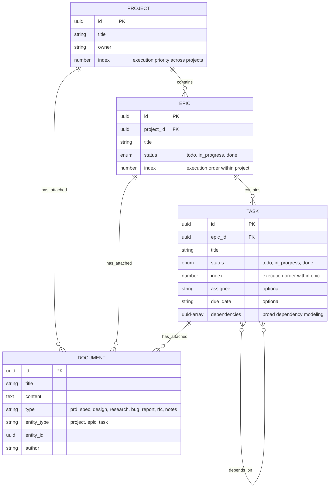

# Project-Centric Architecture with Universal Document Primitives

**Status: PLANNED**

## Overview

This document outlines a fundamental architectural shift from the current rigid PRD-centric model to a flexible Project-centric approach with Documents as universal knowledge primitives. This change addresses real-world project management needs by supporting diverse project types from rapid prototyping to formal enterprise development.

**Key Design Principles:**

- **Index-based prioritization** instead of vague priority labels
- **UUIDs** for robust entity identification
- **Broad dependency modeling** enabling automatic parallelization
- **Simplified primitives** focused on essential fields only
- **Task-centric onboarding** for optimal agent workflows

## Current vs. Proposed Architecture

### Current: Rigid PRD-Centric Model

```typescript
// Forced hierarchy - every project must start with PRD
PRD -> Epic -> Task

// Rigid workflow
1. Create PRD (required bureaucratic step)
2. Break into Epics with vague "priority: high/medium/low"
3. Create Tasks with unclear ordering
4. All documentation must fit into description fields
```

**Problems:**

- Forces formal PRD creation for simple projects (bug fixes, prototypes)
- Priority labels create cognitive overhead ("What does 'high' mean?")
- No clear execution order within priority groups
- Limited documentation capabilities
- Poor parallelization due to unclear dependencies

### Proposed: Flexible Project-Centric Model

```typescript
// Flexible hierarchy - start with what you need
Project (state container) -> Epic -> Task
Documents (universal primitive) -> Attach to any level

// Adaptive workflow with clear ordering
1. Create Project (lightweight state container)
2. Add Documents as needed (specs, designs, research, etc.)
3. Create Epics/Tasks with clear index-based ordering
4. Model ALL blocking relationships as dependencies
5. Automatic parallelization based on dependency resolution
```

**Benefits:**

- **Clear Execution Order**: Index 1, 2, 3... no ambiguity
- **Automatic Parallelization**: Dependencies determine what can run in parallel
- **Flexible Documentation**: Attach specs, designs, research anywhere
- **Natural Workflow**: Structure emerges based on needs
- **Agent Clarity**: Task-centric onboarding with clear context

## Data Model Transformation

### New Entity Relationships



### Key Changes from Current Model

1. **UUIDs**: All entities use proper UUIDs instead of generated strings
2. **Index-based Prioritization**: Replace "priority: high/medium/low" with clear numeric ordering
3. **Simplified Status**: 3-state model (todo/in_progress/done) instead of complex workflows
4. **Broad Dependencies**: Model any blocking relationship (technical, resource, business)
5. **Removed Overhead**: No timestamps, metadata, computed fields, or redundant descriptions

## Core Primitives (Simplified)

### **Project Interface**

```typescript
export interface Project {
  id: string; // UUID
  title: string; // Project name
  owner: string; // Project owner
  index: number; // Execution priority across all projects (1 = highest)
}
```

**Rationale:**

- **No type field**: Agents adapt to content, not arbitrary categories
- **No status**: Computed from epic completion percentage
- **No metadata**: Use documents for flexible information storage
- **Index-based ordering**: Clear priority across organizational projects

### **Epic Interface**

```typescript
export interface Epic {
  id: string; // UUID
  project_id: string; // UUID of parent project
  title: string; // Epic name
  status: "todo" | "in_progress" | "done";
  index: number; // Execution order within project (1 = first)
}
```

**Rationale:**

- **No description**: Use attached documents for detailed specifications
- **No priority labels**: Index provides clear execution order
- **Simplified status**: 3-state model reduces cognitive overhead

### **Task Interface**

```typescript
export interface Task {
  id: string; // UUID
  epic_id: string; // UUID of parent epic
  title: string; // Task name
  status: "todo" | "in_progress" | "done";
  index: number; // Execution order within epic (1 = first)
  assignee?: string; // Optional task assignee
  due_date?: string; // Optional due date (ISO string)
  dependencies?: string[]; // Array of UUIDs for ANY blocking relationship
}
```

**Rationale:**

- **No description**: Use attached documents for detailed specifications
- **Broad dependencies**: Models technical, resource, business, and coordination blocks
- **Index ordering**: Clear sequence within epic
- **Minimal fields**: Only essential information for execution

### **Document Interface**

```typescript
export interface Document {
  id: string; // UUID
  title: string; // Document title
  content: string; // Document content (markdown, code, JSON, etc.)
  type: string; // Flexible: "prd", "spec", "design", "implementation_notes", etc.
  entity_type: "project" | "epic" | "task";
  entity_id: string; // UUID of attached entity
  author: string; // Document author
}
```

**Rationale:**

- **No format field**: Type implies format (spec = markdown, code_snippet = code)
- **No versioning**: Avoid premature optimization
- **Flexible type**: Project-specific document categories
- **Universal attachment**: Can attach to any entity level

## Parallelization Through Dependency Resolution

### **Broad Dependency Modeling**

Dependencies capture **any reason one task must wait for another**:

```typescript
// Technical dependency
{
  id: "task-auth-service",
  title: "Set up authentication service",
  dependencies: []
}
{
  id: "task-login-endpoint",
  title: "Create login endpoint",
  dependencies: ["task-auth-service"] // Needs auth service first
}

// Resource dependency (same person)
{
  id: "task-payments",
  title: "Implement payments",
  assignee: "alice",
  dependencies: []
}
{
  id: "task-analytics",
  title: "Implement analytics",
  assignee: "alice",
  dependencies: ["task-payments"] // Alice can't do both simultaneously
}

// Integration dependency (avoid conflicts)
{
  id: "task-refactor-user-service",
  title: "Refactor user service",
  dependencies: []
}
{
  id: "task-add-user-validation",
  title: "Add user validation",
  dependencies: ["task-refactor-user-service"] // Avoid merge conflicts
}

// Business logic dependency
{
  id: "task-launch-feature-a",
  title: "Launch core feature",
  dependencies: []
}
{
  id: "task-launch-feature-b",
  title: "Launch secondary feature",
  dependencies: ["task-launch-feature-a"] // Avoid user confusion
}
```

### **Automatic Parallelization Algorithm**

```typescript
/**
 * Identifies tasks that can be executed in parallel based on dependency resolution
 */
function getParallelizableTasks(tasks: Task[]): Task[] {
  const todoTasks = tasks.filter((t) => t.status === "todo");
  const completedTaskIds = new Set(tasks.filter((t) => t.status === "done").map((t) => t.id));

  // Tasks with all dependencies satisfied can run in parallel
  return todoTasks
    .filter((task) => task.dependencies?.every((depId) => completedTaskIds.has(depId)) ?? true)
    .sort((a, b) => a.index - b.index); // Respect index ordering within parallelizable set
}

/**
 * Get next recommended task for a specific assignee
 */
function getNextTaskForAssignee(tasks: Task[], assignee: string): Task | null {
  const parallelizable = getParallelizableTasks(tasks);
  const assigneeTasks = parallelizable.filter((t) => t.assignee === assignee);

  return assigneeTasks.length > 0 ? assigneeTasks[0] : null; // Lowest index
}

/**
 * Identify resource conflicts in parallelizable tasks
 */
function identifyResourceConflicts(tasks: Task[]): string[] {
  const parallelizable = getParallelizableTasks(tasks);
  const assigneeCount = new Map<string, number>();

  parallelizable.forEach((task) => {
    if (task.assignee) {
      assigneeCount.set(task.assignee, (assigneeCount.get(task.assignee) || 0) + 1);
    }
  });

  return Array.from(assigneeCount.entries())
    .filter(([_, count]) => count > 1)
    .map(([assignee, count]) => `${assignee} has ${count} parallelizable tasks`);
}
```

### **Real-World Parallelization Example**

```typescript
const tasks = [
  { id: "uuid-1", title: "Database setup", dependencies: [], status: "done", index: 1 },
  { id: "uuid-2", title: "API framework", dependencies: [], status: "done", index: 2 },
  {
    id: "uuid-3",
    title: "User auth endpoint",
    dependencies: ["uuid-1", "uuid-2"],
    status: "todo",
    index: 3,
    assignee: "alice",
  },
  {
    id: "uuid-4",
    title: "Product catalog endpoint",
    dependencies: ["uuid-1", "uuid-2"],
    status: "todo",
    index: 4,
    assignee: "bob",
  },
  {
    id: "uuid-5",
    title: "Frontend auth",
    dependencies: ["uuid-3"],
    status: "todo",
    index: 5,
    assignee: "charlie",
  },
  {
    id: "uuid-6",
    title: "Frontend catalog",
    dependencies: ["uuid-4"],
    status: "todo",
    index: 6,
    assignee: "diana",
  },
];

const parallelizable = getParallelizableTasks(tasks);
// Returns: [uuid-3, uuid-4] - Alice and Bob can work on API endpoints simultaneously

const nextForAlice = getNextTaskForAssignee(tasks, "alice");
// Returns: uuid-3 (User auth endpoint)

const conflicts = identifyResourceConflicts(tasks);
// Returns: [] (no conflicts - different assignees)
```

## Implementation Guide

### Step 1: Update Core Types

Update `types.ts` with refined interfaces:

```typescript
// Core entity interfaces
export interface Project {
  id: string; // UUID
  title: string;
  owner: string;
  index: number;
}

export interface Epic {
  id: string; // UUID
  project_id: string; // UUID
  title: string;
  status: "todo" | "in_progress" | "done";
  index: number;
}

export interface Task {
  id: string; // UUID
  epic_id: string; // UUID
  title: string;
  status: "todo" | "in_progress" | "done";
  index: number;
  assignee?: string;
  due_date?: string;
  dependencies?: string[]; // Array of UUIDs
}

export interface Document {
  id: string; // UUID
  title: string;
  content: string;
  type: string;
  entity_type: "project" | "epic" | "task";
  entity_id: string; // UUID
  author: string;
}

// Updated data container
export interface ProjectData {
  projects: Project[];
  documents: Document[];
  epics: Epic[];
  tasks: Task[];
}

// Enhanced project view with documents
export interface ProjectWithDetails extends Project {
  documents: Document[];
  epics: Array<
    Epic & {
      tasks: Task[];
      documents: Document[];
    }
  >;
}

// Parallelization response
export interface ParallelizationAnalysis {
  parallelizable_tasks: Task[];
  blocked_tasks: Array<{
    task: Task;
    blocking_dependencies: string[];
  }>;
  resource_conflicts: string[];
  next_tasks_by_assignee: Record<string, Task | null>;
}
```

### Step 2: UUID Generation and Index Management

```typescript
import { v4 as uuidv4 } from "uuid";

class TaskManager {
  private generateUUID(): string {
    return uuidv4();
  }

  private async getNextIndex(
    entityType: "project" | "epic" | "task",
    parentId?: string
  ): Promise<number> {
    const data = await this.loadData();

    switch (entityType) {
      case "project":
        const maxProjectIndex = Math.max(0, ...data.projects.map((p) => p.index));
        return maxProjectIndex + 1;

      case "epic":
        const projectEpics = data.epics.filter((e) => e.project_id === parentId);
        const maxEpicIndex = Math.max(0, ...projectEpics.map((e) => e.index));
        return maxEpicIndex + 1;

      case "task":
        const epicTasks = data.tasks.filter((t) => t.epic_id === parentId);
        const maxTaskIndex = Math.max(0, ...epicTasks.map((t) => t.index));
        return maxTaskIndex + 1;
    }
  }

  // Reorder entities by updating indexes
  async reorderEpics(
    projectId: string,
    epicOrders: Array<{ id: string; index: number }>
  ): Promise<void> {
    const data = await this.loadData();

    epicOrders.forEach(({ id, index }) => {
      const epicIndex = data.epics.findIndex((e) => e.id === id);
      if (epicIndex !== -1) {
        data.epics[epicIndex].index = index;
      }
    });

    await this.saveData(data);
  }

  async reorderTasks(
    epicId: string,
    taskOrders: Array<{ id: string; index: number }>
  ): Promise<void> {
    const data = await this.loadData();

    taskOrders.forEach(({ id, index }) => {
      const taskIndex = data.tasks.findIndex((t) => t.id === id);
      if (taskIndex !== -1) {
        data.tasks[taskIndex].index = index;
      }
    });

    await this.saveData(data);
  }
}
```

### Step 3: Parallelization API Methods

```typescript
class TaskManager {
  // Parallelization analysis
  async analyzeParallelization(
    projectId?: string,
    epicId?: string
  ): Promise<ParallelizationAnalysis> {
    const data = await this.loadData();
    let tasks: Task[];

    if (epicId) {
      tasks = data.tasks.filter((t) => t.epic_id === epicId);
    } else if (projectId) {
      const projectEpics = data.epics.filter((e) => e.project_id === projectId);
      const epicIds = projectEpics.map((e) => e.id);
      tasks = data.tasks.filter((t) => epicIds.includes(t.epic_id));
    } else {
      tasks = data.tasks;
    }

    const parallelizable = this.getParallelizableTasks(tasks);
    const blocked = this.getBlockedTasks(tasks);
    const conflicts = this.identifyResourceConflicts(parallelizable);
    const nextByAssignee = this.getNextTasksByAssignee(parallelizable);

    return {
      parallelizable_tasks: parallelizable,
      blocked_tasks: blocked,
      resource_conflicts: conflicts,
      next_tasks_by_assignee: nextByAssignee,
    };
  }

  private getParallelizableTasks(tasks: Task[]): Task[] {
    const todoTasks = tasks.filter((t) => t.status === "todo");
    const completedTaskIds = new Set(tasks.filter((t) => t.status === "done").map((t) => t.id));

    return todoTasks
      .filter((task) => task.dependencies?.every((depId) => completedTaskIds.has(depId)) ?? true)
      .sort((a, b) => a.index - b.index);
  }

  private getBlockedTasks(tasks: Task[]): Array<{ task: Task; blocking_dependencies: string[] }> {
    const todoTasks = tasks.filter((t) => t.status === "todo");
    const completedTaskIds = new Set(tasks.filter((t) => t.status === "done").map((t) => t.id));

    return todoTasks
      .filter((task) => task.dependencies?.some((depId) => !completedTaskIds.has(depId)) ?? false)
      .map((task) => ({
        task,
        blocking_dependencies:
          task.dependencies?.filter((depId) => !completedTaskIds.has(depId)) || [],
      }));
  }

  private identifyResourceConflicts(tasks: Task[]): string[] {
    const assigneeCount = new Map<string, number>();

    tasks.forEach((task) => {
      if (task.assignee) {
        assigneeCount.set(task.assignee, (assigneeCount.get(task.assignee) || 0) + 1);
      }
    });

    return Array.from(assigneeCount.entries())
      .filter(([_, count]) => count > 1)
      .map(([assignee, count]) => `${assignee} has ${count} parallelizable tasks`);
  }

  private getNextTasksByAssignee(tasks: Task[]): Record<string, Task | null> {
    const result: Record<string, Task | null> = {};
    const assignees = new Set(tasks.map((t) => t.assignee).filter(Boolean));

    assignees.forEach((assignee) => {
      const assigneeTasks = tasks.filter((t) => t.assignee === assignee);
      result[assignee!] = assigneeTasks.length > 0 ? assigneeTasks[0] : null;
    });

    return result;
  }
}
```

### Step 4: Enhanced Onboarding with Parallelization Context

```typescript
// Onboarding interfaces
export interface OnboardParams {
  entity_type: "project" | "epic" | "task";
  entity_id: string;
  include_context?: boolean;
  include_parallelization?: boolean; // New: include parallelization analysis
}

export interface OnboardResponse {
  entity: Project | Epic | Task;
  documents: Document[];
  context?: {
    parent?: Project | Epic;
    siblings?: Array<Epic | Task>;
    children?: Array<Epic | Task>;
  };
  parallelization?: ParallelizationAnalysis; // New: parallelization insights
}

// Enhanced onboarding implementation
class TaskManager {
  async onboard(params: OnboardParams): Promise<OnboardResponse> {
    const data = await this.loadData();

    // Get the main entity
    let entity: Project | Epic | Task;
    switch (params.entity_type) {
      case "project":
        entity = data.projects.find((p) => p.id === params.entity_id)!;
        break;
      case "epic":
        entity = data.epics.find((e) => e.id === params.entity_id)!;
        break;
      case "task":
        entity = data.tasks.find((t) => t.id === params.entity_id)!;
        break;
      default:
        throw new Error(`Invalid entity type: ${params.entity_type}`);
    }

    if (!entity) {
      throw new Error(`${params.entity_type} ${params.entity_id} not found`);
    }

    // Get attached documents
    const documents = await this.getDocumentsByEntity(params.entity_type, params.entity_id);

    // Build response
    const response: OnboardResponse = { entity, documents };

    // Add context if requested
    if (params.include_context) {
      response.context = await this.buildEntityContext(params.entity_type, params.entity_id, data);
    }

    // Add parallelization analysis if requested
    if (params.include_parallelization) {
      if (params.entity_type === "project") {
        response.parallelization = await this.analyzeParallelization(params.entity_id);
      } else if (params.entity_type === "epic") {
        response.parallelization = await this.analyzeParallelization(undefined, params.entity_id);
      } else if (params.entity_type === "task") {
        // For tasks, analyze the parent epic
        const task = entity as Task;
        response.parallelization = await this.analyzeParallelization(undefined, task.epic_id);
      }
    }

    return response;
  }
}
```

### Step 5: Updated Tool Definitions

```typescript
const tools: Tool[] = [
  // Project Management
  {
    name: "create_project",
    description: "Create a new project with automatic index assignment",
    inputSchema: {
      type: "object",
      properties: {
        title: { type: "string", description: "Project title" },
        owner: { type: "string", description: "Project owner" },
      },
      required: ["title", "owner"],
    },
  },

  {
    name: "reorder_epics",
    description: "Reorder epics within a project by updating their index values",
    inputSchema: {
      type: "object",
      properties: {
        project_id: { type: "string", description: "Project UUID" },
        epic_orders: {
          type: "array",
          items: {
            type: "object",
            properties: {
              id: { type: "string", description: "Epic UUID" },
              index: { type: "number", description: "New index position" },
            },
            required: ["id", "index"],
          },
        },
      },
      required: ["project_id", "epic_orders"],
    },
  },

  {
    name: "reorder_tasks",
    description: "Reorder tasks within an epic by updating their index values",
    inputSchema: {
      type: "object",
      properties: {
        epic_id: { type: "string", description: "Epic UUID" },
        task_orders: {
          type: "array",
          items: {
            type: "object",
            properties: {
              id: { type: "string", description: "Task UUID" },
              index: { type: "number", description: "New index position" },
            },
            required: ["id", "index"],
          },
        },
      },
      required: ["epic_id", "task_orders"],
    },
  },

  {
    name: "analyze_parallelization",
    description: "Analyze which tasks can be parallelized based on dependency resolution",
    inputSchema: {
      type: "object",
      properties: {
        project_id: { type: "string", description: "Optional: analyze specific project" },
        epic_id: { type: "string", description: "Optional: analyze specific epic" },
      },
    },
  },

  {
    name: "create_tasks",
    description: "Create multiple tasks with broad dependency modeling",
    inputSchema: {
      type: "object",
      properties: {
        tasks: {
          type: "array",
          items: {
            type: "object",
            properties: {
              epic_id: { type: "string", description: "Epic UUID" },
              title: { type: "string", description: "Task title" },
              assignee: { type: "string", description: "Optional assignee" },
              due_date: { type: "string", description: "Optional due date (ISO format)" },
              dependencies: {
                type: "array",
                items: { type: "string" },
                description: "Array of task UUIDs that must complete before this task",
              },
            },
            required: ["epic_id", "title"],
          },
        },
      },
      required: ["tasks"],
    },
  },

  {
    name: "onboard",
    description: "Get comprehensive context for entity including parallelization analysis",
    inputSchema: {
      type: "object",
      properties: {
        entity_type: {
          type: "string",
          enum: ["project", "epic", "task"],
          description: "Type of entity to onboard to",
        },
        entity_id: { type: "string", description: "Entity UUID" },
        include_context: {
          type: "boolean",
          description: "Include parent/sibling/children context",
          default: true,
        },
        include_parallelization: {
          type: "boolean",
          description: "Include parallelization analysis",
          default: false,
        },
      },
      required: ["entity_type", "entity_id"],
    },
  },

  // Document management tools remain the same but use UUIDs
  {
    name: "create_document",
    description: "Create a document and attach it to a project, epic, or task",
    inputSchema: {
      type: "object",
      properties: {
        title: { type: "string", description: "Document title" },
        content: { type: "string", description: "Document content" },
        type: {
          type: "string",
          description: "Document type (e.g., 'prd', 'spec', 'design', 'implementation_notes')",
        },
        entity_type: {
          type: "string",
          enum: ["project", "epic", "task"],
          description: "Type of entity to attach to",
        },
        entity_id: { type: "string", description: "UUID of entity to attach to" },
        author: { type: "string", description: "Document author" },
      },
      required: ["title", "content", "type", "entity_type", "entity_id", "author"],
    },
  },
];
```

## Use Case Examples with Index-Based Prioritization

### 1. Bug Fix Project with Clear Ordering

```typescript
// Create lightweight bug fix project
const project = await createProject({
  title: "Fix login timeout issue",
  owner: "jane_smith",
  // index: auto-assigned as 1 (highest priority)
});

// Attach bug report document
await createDocument({
  title: "Bug Report #1234",
  content: "Users experiencing timeouts after 5 minutes...",
  type: "bug_report",
  entity_type: "project",
  entity_id: project.id,
  author: "user_reporter",
});

// Create single epic
const epic = await createEpic({
  project_id: project.id,
  title: "Fix session timeout",
  status: "todo",
  // index: auto-assigned as 1
});

// Create tasks with clear ordering and dependencies
const tasks = await createTasks({
  tasks: [
    {
      epic_id: epic.id,
      title: "Investigate timeout root cause",
      assignee: "jane_smith",
      // index: auto-assigned as 1
      dependencies: [], // Can start immediately
    },
    {
      epic_id: epic.id,
      title: "Update session timeout constant",
      assignee: "jane_smith",
      // index: auto-assigned as 2
      dependencies: [
        /* UUID of investigation task */
      ], // Must investigate first
    },
    {
      epic_id: epic.id,
      title: "Update timeout documentation",
      assignee: "tech_writer",
      // index: auto-assigned as 3
      dependencies: [
        /* UUID of fix task */
      ], // Can parallelize after fix
    },
  ],
});

// Analyze parallelization
const analysis = await analyzeParallelization(undefined, epic.id);
// Shows: Investigation can start immediately
// Fix task blocked by investigation
// Documentation task blocked by fix
// But documentation and testing could be parallel after fix
```

### 2. Complex Feature Project with Parallelization

```typescript
// Create feature project
const project = await createProject({
  title: "Multi-factor Authentication",
  owner: "product_team",
});

// Attach comprehensive PRD
await createDocument({
  title: "Product Requirements Document",
  content: `
# Multi-factor Authentication

## Overview
Implement secure 2FA for all user accounts...

## Success Criteria
- 95% user adoption within 3 months
- Zero security incidents related to authentication
  `,
  type: "prd",
  entity_type: "project",
  entity_id: project.id,
  author: "product_manager",
});

// Create ordered epics
const epics = await createEpics({
  epics: [
    {
      project_id: project.id,
      title: "Infrastructure Setup",
      status: "todo",
      // index: 1 (must be first)
    },
    {
      project_id: project.id,
      title: "SMS-based 2FA",
      status: "todo",
      // index: 2
    },
    {
      project_id: project.id,
      title: "App-based 2FA",
      status: "todo",
      // index: 3
    },
  ],
});

// Create tasks with complex dependencies
const tasks = await createTasks({
  tasks: [
    // Infrastructure Epic Tasks
    {
      epic_id: epics[0].id,
      title: "Set up 2FA database tables",
      assignee: "alice",
      dependencies: [],
    },
    {
      epic_id: epics[0].id,
      title: "Configure SMS provider",
      assignee: "bob",
      dependencies: [], // Can parallelize with database
    },

    // SMS Epic Tasks
    {
      epic_id: epics[1].id,
      title: "Implement SMS verification endpoint",
      assignee: "alice",
      dependencies: [
        /* database task UUID */
      ], // Needs DB
    },
    {
      epic_id: epics[1].id,
      title: "Create SMS verification UI",
      assignee: "charlie",
      dependencies: [
        /* SMS endpoint UUID */
      ], // Needs API first
    },

    // App Epic Tasks
    {
      epic_id: epics[2].id,
      title: "Implement TOTP endpoint",
      assignee: "alice",
      dependencies: [
        /* database task UUID */
      ], // Only needs DB, not SMS
    },
    {
      epic_id: epics[2].id,
      title: "Create TOTP setup UI",
      assignee: "diana",
      dependencies: [
        /* TOTP endpoint UUID */
      ], // Needs API first
    },
  ],
});

// Analyze parallelization opportunities
const analysis = await analyzeParallelization(project.id);

// Results show:
// - Database and SMS provider setup can be parallel (different people)
// - Once DB is done, SMS and TOTP endpoints can be parallel (Alice needs sequencing)
// - UI work can be parallel once respective APIs are ready
// - Clear identification of Alice as potential bottleneck
```

## Agent Workflow Examples

### 1. Planning Agent with Index-Based Prioritization

```typescript
// Planning agent reorders work based on business priorities
const epics = await getEpics({ project_id: "project-uuid" });

// Planning LLM analyzes and reorders
const reorderedEpics = await planningLLM.prioritize(epics, {
  criteria: ["business_value", "risk", "dependencies"],
});

// Apply new clear ordering
await reorderEpics("project-uuid", [
  { id: "epic-auth-uuid", index: 1 }, // Highest priority
  { id: "epic-payments-uuid", index: 2 }, // Second priority
  { id: "epic-analytics-uuid", index: 3 }, // Third priority
]);

// Tasks within epics also get reordered
await reorderTasks("epic-auth-uuid", [
  { id: "task-security-uuid", index: 1 }, // Most critical
  { id: "task-ui-uuid", index: 2 }, // After security
  { id: "task-testing-uuid", index: 3 }, // Final validation
]);
```

### 2. Execution Agent with Parallelization Awareness

```typescript
// Agent gets assigned to work
const context = await onboard({
  entity_type: "task",
  entity_id: "task-implement-sms",
  include_context: true,
  include_parallelization: true,
});

// Agent understands its place in the execution order
console.log(`Working on task #${context.entity.index} in epic #${context.context.parent.index}`);
// "Working on task #2 in epic #1"

// Agent sees parallelization opportunities
const { parallelizable_tasks, resource_conflicts } = context.parallelization;

if (resource_conflicts.length > 0) {
  console.log("Resource conflicts detected:", resource_conflicts);
  // "alice has 3 parallelizable tasks" - suggests dependencies needed
}

// Agent can suggest dependency modeling
if (parallelizable_tasks.filter((t) => t.assignee === "alice").length > 1) {
  await suggestTaskDependencies("alice", parallelizable_tasks);
}
```

### 3. Coordination Agent Managing Dependencies

```typescript
// Agent analyzes workflow bottlenecks
const analysis = await analyzeParallelization("project-uuid");

// Identify coordination issues
const resourceConflicts = analysis.resource_conflicts;
if (resourceConflicts.length > 0) {
  // Agent suggests dependency modeling
  for (const conflict of resourceConflicts) {
    const assignee = conflict.split(" ")[0];
    const assigneeTasks = analysis.parallelizable_tasks.filter((t) => t.assignee === assignee);

    // Suggest sequencing based on task complexity or business priority
    const sequencedTasks = await coordinationLLM.sequenceTasks(assigneeTasks);

    // Update dependencies to sequence work
    for (let i = 1; i < sequencedTasks.length; i++) {
      await updateTask(sequencedTasks[i].id, {
        dependencies: [sequencedTasks[i - 1].id],
      });
    }
  }
}
```

## Benefits Analysis

### 1. Index-Based Prioritization Benefits

| Priority Labels            | Index Numbers              |
| -------------------------- | -------------------------- |
| ❌ "High priority" (vague) | ✅ "Index 2" (specific)    |
| ❌ Multiple "high" items   | ✅ Only one item per index |
| ❌ Hard to reorder         | ✅ Easy to reorder         |
| ❌ Cognitive overhead      | ✅ Clear mental model      |
| ❌ Planning LLM confusion  | ✅ Planning LLM clarity    |

### 2. Parallelization Benefits

- **Automatic Work Distribution**: Algorithm identifies parallelizable tasks
- **Resource Conflict Detection**: Highlights when same person has multiple tasks
- **Dependency Visualization**: Clear understanding of blocking relationships
- **Optimization Opportunities**: Planning agents can reduce bottlenecks

### 3. Agent Productivity Benefits

- **Clear Execution Order**: No ambiguity about what comes next
- **Task-Centric Onboarding**: Agents start with specific work, drill up for context
- **Parallelization Awareness**: Agents understand coordination requirements
- **Broad Dependency Modeling**: Captures all real-world blocking relationships

## Implementation Considerations

### 1. UUID Management

- **Generate UUIDs**: Use standard UUID library (uuid v4)
- **Index Uniqueness**: Ensure indexes are unique within parent scope
- **Migration**: Convert existing generated IDs to UUIDs during upgrade

### 2. Index Management

- **Auto-Assignment**: New entities get next available index automatically
- **Reordering**: Provide batch reorder operations to avoid conflicts
- **Gap Handling**: Algorithms should work with non-contiguous indexes

### 3. Dependency Validation

- **Cycle Detection**: Prevent circular dependencies during task creation
- **Entity Validation**: Ensure dependency UUIDs reference valid tasks
- **Cross-Epic Dependencies**: Support dependencies across epic boundaries

### 4. Parallelization Performance

- **Caching**: Cache parallelization analysis for large projects
- **Incremental Updates**: Recompute parallelization when dependencies change
- **Scalability**: Algorithm should work efficiently with hundreds of tasks

This architectural improvement provides development agents with clear, unambiguous guidance for implementing a sophisticated project management system that naturally supports real-world workflows through index-based prioritization, broad dependency modeling, and automatic parallelization capabilities.

## Advanced MCP Protocol Features

Based on the MCP TypeScript SDK analysis, our task manager can leverage sophisticated protocol capabilities beyond basic CRUD operations:

### Real-Time Notifications

```typescript
// Automatic list change notifications when data is modified
server.sendResourceListChanged(); // Notify clients when project data changes
server.sendToolListChanged(); // Notify when new tools become available
server.sendPromptListChanged(); // Notify when project templates update

// Progress notifications during long-running operations
async ({ projectId }, { sendNotification }) => {
  await sendNotification({
    method: "notifications/progress",
    params: {
      progressToken: "parallel-analysis",
      progress: { kind: "begin", title: "Analyzing parallelization..." },
    },
  });

  // Perform analysis...

  await sendNotification({
    method: "notifications/progress",
    params: {
      progressToken: "parallel-analysis",
      progress: { kind: "end", message: "Found 5 parallelizable task groups" },
    },
  });
};
```

### Dynamic Tool Registration

```typescript
// Tools can be dynamically added/removed based on project state
const parallelizationTool = server.tool("analyze_parallelization", schema, handler);

// Disable until project has sufficient complexity
parallelizationTool.disable();

// Enable when dependency graph reaches threshold
if (taskCount > 10) {
  parallelizationTool.enable();
  server.sendToolListChanged(); // Auto-notifies clients
}

// Update tool schema based on project evolution
parallelizationTool.update({
  paramSchema: enhancedSchema,
  description: "Enhanced parallelization with resource conflict detection",
});
```

### Contextual Resources

```typescript
// Dynamic resources that adapt to project state
server.resource(
  "project-status",
  new ResourceTemplate("project://{projectId}/status", { list: undefined }),
  async (uri, { projectId }) => {
    const analysis = await analyzeProjectParallelization(projectId);
    return {
      contents: [
        {
          uri: uri.href,
          text: JSON.stringify(
            {
              parallelizable_tasks: analysis.parallelGroups,
              blocked_tasks: analysis.blockedTasks,
              resource_conflicts: analysis.conflicts,
              estimated_completion: analysis.timeline,
            },
            null,
            2
          ),
        },
      ],
    };
  }
);
```

### Session Management

Our stateful project management requires session handling for:

- **Project context persistence**: Maintain active project state across requests
- **User-specific views**: Filter tasks by assignee, track personal progress
- **Real-time collaboration**: Coordinate multi-user project updates

```typescript
// Session-aware task management
const sessions = new Map<string, ProjectSession>();

app.post("/mcp", async (req, res) => {
  const sessionId = req.headers["mcp-session-id"] as string;
  let session = sessions.get(sessionId);

  if (!session && isInitializeRequest(req.body)) {
    session = new ProjectSession({
      userId: extractUserId(req),
      activeProject: null,
      preferences: defaultPreferences,
    });
    sessions.set(sessionId, session);
  }

  // Request handling with session context...
});
```

### Streaming Task Execution

For complex operations like dependency resolution:

```typescript
server.tool(
  "execute_parallel_tasks",
  { taskIds: z.array(z.string()), maxConcurrency: z.number().optional() },
  async ({ taskIds, maxConcurrency = 3 }, { sendNotification }) => {
    const groups = await analyzeParallelization(taskIds);

    for (const [groupIndex, group] of groups.entries()) {
      await sendNotification({
        method: "notifications/progress",
        params: {
          progressToken: "parallel-execution",
          progress: {
            kind: "report",
            message: `Executing group ${groupIndex + 1}/${groups.length}`,
            percentage: (groupIndex / groups.length) * 100,
          },
        },
      });

      // Execute tasks in parallel with resource conflict prevention
      await executeTaskGroup(group, maxConcurrency);
    }

    return {
      content: [
        {
          type: "text",
          text: `Completed ${taskIds.length} tasks in ${groups.length} parallel groups`,
        },
      ],
    };
  }
);
```

### Transport Flexibility

Support multiple deployment scenarios:

- **stdio**: Direct CLI integration for development workflows
- **Streamable HTTP**: Remote server deployment with session management
- **SSE fallback**: Real-time updates for web-based project dashboards

### Enhanced Agent Capabilities

With these advanced MCP features, agents can:

#### 1. Adaptive Behavior

```typescript
// Tools become available based on project complexity
if (project.task_count < 5) {
  // Simple tools: create_task, update_task
} else if (project.task_count < 20) {
  // Medium tools: + analyze_dependencies
} else {
  // Complex tools: + analyze_parallelization, optimize_resource_allocation
}
```

#### 2. Real-Time Collaboration

```typescript
// Agent A modifies a task
await updateTask(taskId, { status: "in_progress" });

// Agent B automatically gets notified via resource list change
// Agent C working on dependent task sees status update

// Coordination agent detects resource conflicts and suggests rebalancing
```

#### 3. Progress Visibility

```typescript
// Long-running parallelization analysis provides real-time updates
// Clients can display progress bars for complex operations
// Agents can make informed decisions about when to wait vs. work on other tasks
```

#### 4. Context-Aware Resources

```typescript
// Project dashboard resource updates automatically
// Dependency graphs reflect current state
// Resource conflict reports update as tasks are completed/reassigned
```

This technical depth enables our task manager to provide enterprise-grade project management capabilities while maintaining the simplicity agents need for effective operation. The MCP protocol's advanced features transform our system from a basic CRUD interface into a sophisticated, real-time collaboration platform optimized for AI agent workflows.
